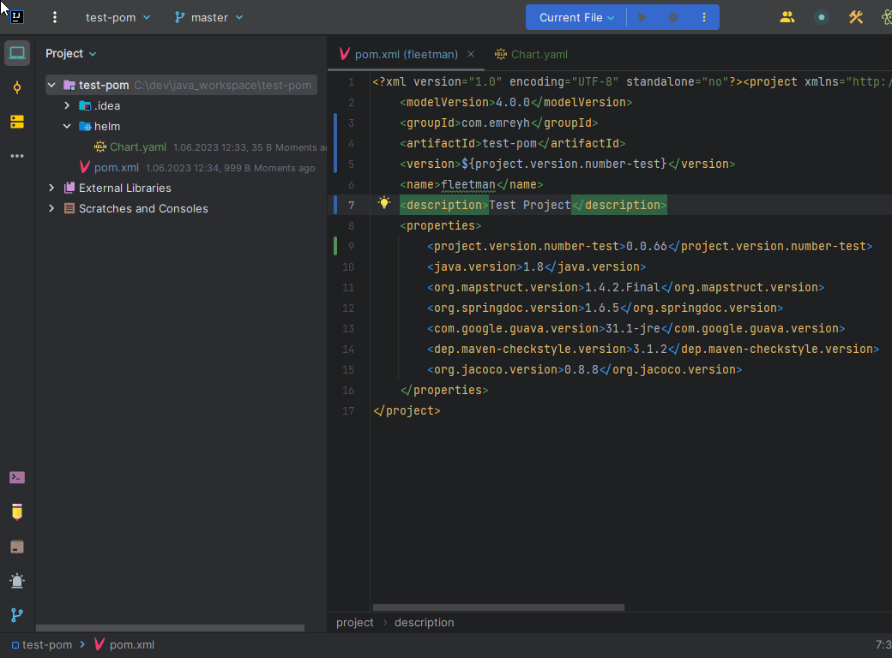

# Project Version Increment

This is a utility tool for incrementing the version number of a project. It is designed to work with projects that use Maven for build management and Helm for packaging and deployment.

## Features

- Automatically increments the version number in the Helm chart (`Chart.yaml`) and Maven project (`pom.xml`) files.
- Supports both single-level and multi-level version numbers (e.g., `1.0.0` or `1.0.0-SNAPSHOT`).
- Updates the project files and refreshes them in IntelliJ IDEA for immediate use.

## How to Use
# Project Version Increment

Project Version Increment is a plugin for IntelliJ IDEA that allows you to automatically increment the version number of your project. This plugin is useful for projects that follow a versioning scheme and require frequent version updates.

## How to Use

To install the Project Version Increment plugin and use it in IntelliJ IDEA, follow the steps below:

1. Go to the [releases](https://github.com/emreyh/project-version-increment/releases) page of the GitHub repository.

2. Under the latest release, locate the `project-version-increment-x.x.x.zip` file under the "Assets" section. Download this file to your computer.

3. Open IntelliJ IDEA and go to the **File** menu in the top left corner.

4. From the menu, select **Settings** or **Preferences** (depending on your operating system).

5. In the settings window, click on **Plugins** from the left-hand menu.

6. Click on the **Install plugin from Disk...** button in the top right corner.

7. In the file browser that appears, select the `project-version-increment-x.x.x.zip` file you downloaded, and click **OK**.

8. Once the installation is complete, you will be prompted to restart IntelliJ IDEA. Click on **Restart IDE** to restart.

9. After IntelliJ IDEA restarts, navigate to the directory where your project is located and open the project.

10. You will now see the **Project Version Increment** option under the **Tools** menu. Click on it to automatically increment the version number.

By following these steps, you can install the Project Version Increment plugin and use it to automatically increment the version number of your project in IntelliJ IDEA.

## Requirements

- IntelliJ IDEA (Community or Ultimate edition)

## License

This project is licensed under the MIT License. See the [LICENSE](LICENSE) file for details.
